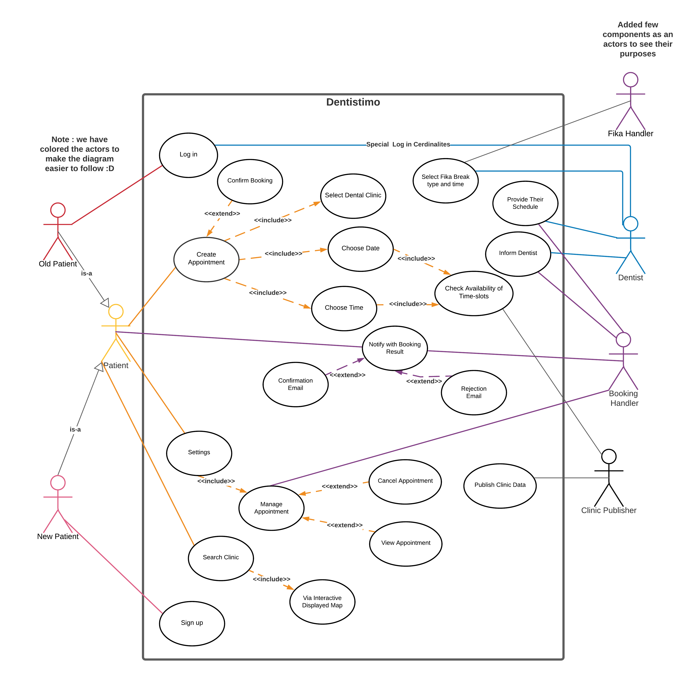
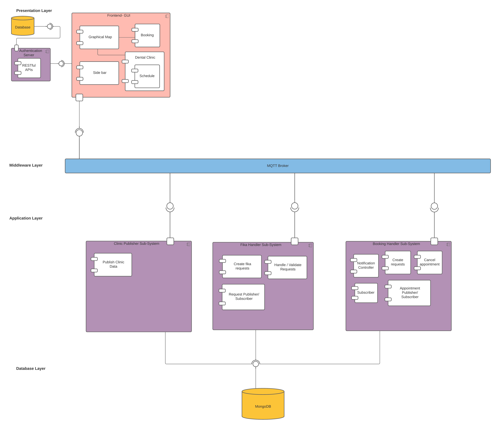
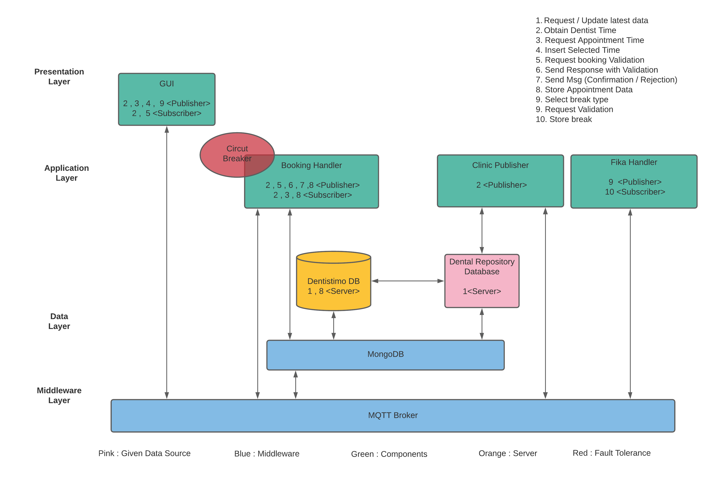
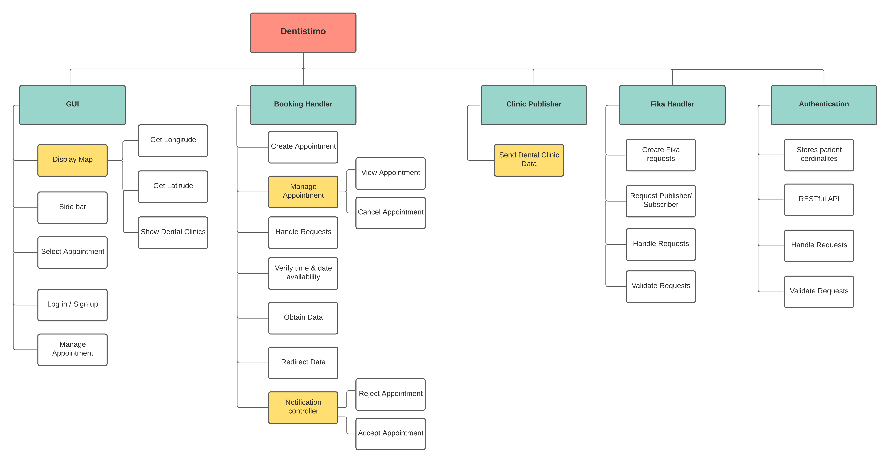

# **Team-11 Dentistimo Project**

## Table of contents :
1. [Purpose](https://git.chalmers.se/courses/dit355/test-teams-formation/team-11/documentation#purpose)
   1. [What](https://git.chalmers.se/courses/dit355/test-teams-formation/team-11/documentation#what-we-are-going-to-make-)
   1. [Why](https://git.chalmers.se/courses/dit355/test-teams-formation/team-11/documentation#why-are-we-going-to-make-it-)
   1. [How](https://git.chalmers.se/courses/dit355/test-teams-formation/team-11/documentation#how-are-we-going-to-make-it-)
   1. [Resources](https://git.chalmers.se/courses/dit355/test-teams-formation/team-11/documentation#resources-)
2. [Software Requirements Specification (SRS)](https://git.chalmers.se/courses/dit355/test-teams-formation/team-11/documentation#software-requirements-specification-srs)
3. [Software Architecture Document (SAD)](https://git.chalmers.se/courses/dit355/test-teams-formation/team-11/documentation#software-architecture-document-sad)
4. [Project Management Report (PMR)](https://git.chalmers.se/courses/dit355/test-teams-formation/team-11/documentation#project-management-report-pmr)
5. [Developers](https://git.chalmers.se/courses/dit355/test-teams-formation/team-11/documentation#developers)

---
## Purpose
### What we are going to make ?
We'll create a web application that allows Gothenburg residents to schedule dental appointments. The software system will provide an interactive map that visualize Gothenburg, the patient can use it to naviagate and locate multiple dental offices.Consequently, The patient can select the available dentist clinics to schedule an appointment with on the app, also being able to manage their current appointment(s).

### Why are we going to make it ? (Forces & Drivers) 
There is an obvious need for this type of system in our city Gothenburg, and there is currently no system that allows patients to choose from a variety of dental offices in a simplified manner.So we are developing this web application to provide straightforward graphical interface which everyone can use effortlessly to book and manage their appointment(s). 
### How are we going to make it ?
We'll use Vue.js , Nodejs and Javascript to create a distributed web application system that uses the MQTT protocol as the middleware.
### Resources :
- [Trello](https://trello.com/invite/b/CFmaWwTU/ee987793842d47e3a0d3b0e7111f9228/dit-355-2021-team-11)
- [GUI-component](https://git.chalmers.se/courses/dit355/test-teams-formation/team-11/team-11-project)
- [Fika Handler-component](https://git.chalmers.se/courses/dit355/test-teams-formation/team-11/dentistimo-fika-handler)
- [Clinic Handler-component](https://git.chalmers.se/courses/dit355/test-teams-formation/team-11/dentistimo-database-handler)
- [Booking Handler-component](https://git.chalmers.se/courses/dit355/test-teams-formation/team-11/dentistimo-booking-handler)
- [Authentication-component](https://git.chalmers.se/courses/dit355/test-teams-formation/team-11/authentication-component)
- MQTT.s
- Vue.js
- Node.js
- Express.js
- Javascript
---

## Software Requirements Specification-SRS
### Epic 1 : Gothenburg Map (GUI)  
The website shall be able to display to the patient, all dental clinics (details) in Gothenburg region via a map.
#### User Stories :
1.1 -> The user interface should be in a web-based format so that the user can use the web app online easily.

1.2 -> As a patient, I would like to be presented with an interactive map showing available dentists in Gothenburg, so that it's effortless to book an appointment.

### Epic 2 : Manage appointments
A patient shall be able to book and manage an appointment(s) for any available clinic(s), through dental given clinic data.
#### User Stories :
2.1 -> As a patient, I would like to book a dentist appointment online so that I don't have to visit the dentist's office.

2.2 -> As a developer I want to be able to receive dental clinic data in JSON format so that I can send it to the clinics using our system.

2.3 -> As a developer, I want the Creation of a "booking" at the request of the patient to be handled by a distributed component. so that the connection between components becomes lightweight.

2.4 -> As a developer, I want the patient to be able to see their booked times, reschedule and cancel so that they can modify their appointment(s)

2.5 -> As a patient, I want to be able to see my booked times and cancel, so that I can modify my appointment(s) in an easy visual way.

2.6 -> As a developer, I want each booking request to be a new document in the database, so that they are easier to handle.

2.7 -> As a developer, I want Improvements in the Clinic handler, so that its easier to send clinic data to other components

2.8 -> As a patient, I want to be sure that the system prevents double booking so that I know that my appointment is valid and is not replicated

### Epic 3 : Breaks
A dentist shall be able to book his break type ( Fika or Lunch ), select an available timeslot according to their schedule, so they can have their leisure time.
#### User Stories :
3.1 -> As a dentist, I want to have a lunch break booking of one hour and a fika break of 30 minutes a day so that I can get some rest during the day.

3.2 -> As a developer, I want the dentist to have a lunch break booking of one hour and a Fika break of 30 minutes a day so that they can get some rest during the day.

### Epic 4 : Authentication
A user shall be verified ( sign-up / log-in) to access the website, different users ( patient or dentist) have slight changes in their interface.
#### User Stories :
4.1 -> As a patient, I want to be able to register myself so that I can sign in, book 
 and manage my appointments. 

4.2 -> As a developer, I want the frontend to be able to fetch the login details provided in the backend so that the user is authenticated.

4.3 -> As a user, I want to stay signed in when revisiting the site so that I don't have to write my password every time.

4.4 -> As a user I want to be able to log in with my credentials so that I can access the site. 

4.5 -> As a dentist at the clinic, I want to have a special kind of account that gives me access to more features than the dental clinic patients. 

### Epic 5 : MQTT
A developer shall be able to use this broker as middleware connection between the distributed components
#### User Stories :
5.1 -> As a developer, I want the front end to use MQTT to communicate with the other components so that we keep our system distributed.

5.2 -> As a developer, I want to have a Pub/Sub architecture style so I can beneficially fully use the MQTT protocol with other components.

5.3 -> As a patient I want the website to respond quickly so that I am not waiting too long for it to do what I want.

### Functional Requirements :
- The system shall consist of multiple distributed components
- MQTT should be used as the middleware broker for the connection between the distributed components
- The users shall verify themselves at the start of the front-end interface, if they are an authorized patient or dentist
- The system shall display a graphical map of Gothenburg, that shows different dentist clinics to the patient
- The map shall display markers to show dental clinics in Gothenburg, and selecting a clinic will provide more information.
- The patient shall be able to book an available timeslot appointment (30min) with the selected dental clinic
- The system shall allow patient(s) to manage their booking(s)
- The system shall allow patient(s) to book a break once per day ( Fika 30min / Lunch 1h ) according to the given free timeslot
- The system shall notify the patient if their booking was successful or rejected

### Non-Functional Requirements :
- Reactivity, The frontend view presented to a patient should update dynamically when data changes
- Web application does not crash
- All elements in the web application should be responsive to mobile screens
- Circuit breaker to handle  fault tolerance between our components
- The majority of the users easily understand the interface within 1 minute
## Software Architecture Document-SAD

### Use Case Diagram :

### Component Diagram :

### Architectural Style Diagram :

### Functional Decomposition Diagram :

**Our Architecture style for this distributed components project:**

The system will consist of four components (with a small RESTful API component) connected together through MQTT Broker

**- GUI ->** A reactive web page built with Express.js , Vue.js and Node.js. This is the user interface of the application, and handles everything the patient/dentist interacts with and uses, such as booking and managing appointments for the patient as well as booking break time for the dentist.

**- Booking Handler ->** is in charge of accepting or rejecting requests from the customer to book a dentist appointment at a certain time.
It checks if the time is available, and if it is sends an acceptance message back to the front-end on a MQTT topic that the front-end subscribed to. Conversely if the time is not available it sends a rejection message in the same manner.

The Booking Handler is also capable of cancelling an already booked time at the request of the customer throught the front-end. It does this by deleting the booking from the database.

In the case that a customer wants to view all the bookings they have made, the booking Handler can also search the database with their credentials and return all the bookings belonging to them, which is then populated on the front-end in an appropriate user-friendly way.

**- Clinic Handler ->** is the component in charge of accessing all the information about the dentist clinics in our database, their location, opening hours etc.

At the request of the customer the frontend sends a message over mqtt to the Clinic Handler, which prompts it to post all the data on all the clinics in the database which the front-end can use to populate the Map with information, this communication occurs over MQTT.

The Clinic Handler can also send the data on just one Clinic, if one is specified.

**- Fika Handler ->** is in charge of handling and validating requests for Fika and Lunch breaks by dentists. If a Fika or Lunch request overlaps with an already booked appointment it will reject the request, otherwise it will accept it. Communication with the front-end occurs with MQTT messages.

**- Authentication ->** is the RESTful API used by our front-end for user authorization. This is it's only purpose, as all other communication occurs over the MQTT broker. It stores an email and a password, which can then be accessed by the front-end via HTTP requests.

All of the components mentioned above along with Database (MongoDB) are communicating through MQTT(JS) Broker via Pub/Sub - Client/Server patterns, which we found the best way in our case to connect through our microservices componnets.

## Project Management Report-PMR
In this project we are following the Scrum development process with multiple sprints to achieve an agile way of working, so we can deliver incremently over each sprint.Initially we assigned roles among ourselves, and brainstormed requirements according to the assignment brief document then we came up with five epics and each epic got its user stories, the user story would get rated through planning poker session in every sprint planning meeting, so we can estimate the effort needed for each user story per sprint.

Kanban board was made in Trello to distribute (assign and pull approach) and visualize our whole project plan.

Consequently we discussed few architectural styles , UML diagrams and mockup UI to have slight visualization on how this distributed components will work together and their purposes.

Finally we started with our sprint by breaking down the work into Back-end and Front-end tasks, and each member self assgin themselves while being cross-functional to help each other as well as making sure everyone understand every component, this process was followed for every sprint onwards.

The team meeting schedule is twice a week, Monday and Friday where we are either having a Sprint Planning /Review / Retrospective OR Group/Pair coding session , where the whole team attends to stay on track during the four Sprints.

The team also had meeting on every Wednesday with TA for checkpoint purposes on our work progress.

Occasionally we would arrange extra meetings to assure our steady pace with each sprint delivery.

Furthermore on our team agreements [code of conduct](Docs/Team Contract)
## Developers
- [Adam Telles](https://git.chalmers.se/adamte)
- [Ahmed Yasser](https://git.chalmers.se/ahmedya)
- [Alex Nordin](https://git.chalmers.se/lnoklal)
- [Axel Broberg](https://git.chalmers.se/axelbro)
- [Anwar Ramadi](https://git.chalmers.se/ramadi)
- [Niklas Höglund](https://git.chalmers.se/nikhog)
- [Noor Asim](https://git.chalmers.se/eeman)

